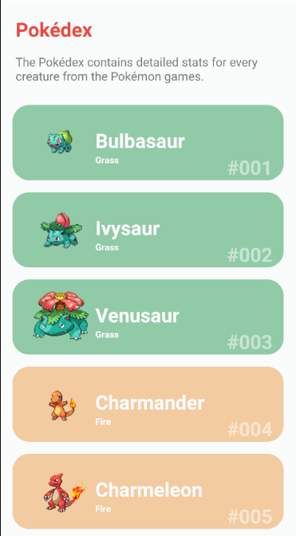
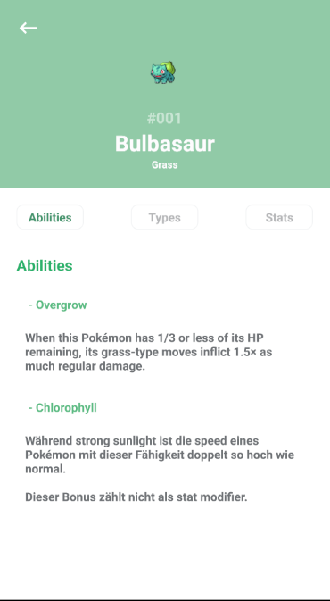

# Pokedex





## Table of contents

- [Pokedex](#pokedex)
  - [Table of contents](#table-of-contents)
  - [Technologies](#technologies)
  - [Requirements](#requirements)
  - [Setup](#setup)

## Technologies

This Pokedex mobile app is created with:

- React Native + Expo
- TypeScript
- Styled Components
- Axios

## Requirements

To be able to run this project you need to have installed the Expo CLI, NodeJS and Android Studio.

## Setup

To run this project, first you need to clone the repo:

```
$ git clone https://github.com/MongeJp/Pokedex.git
```

Then you need to move to the project folder and install the dependencies (it can be via yarn or npm).

```
$ cd Pokedex
$ yarn install
```

Now you can either run the app via using the Expo Go App and scanning the QR code shown running yarn start or run the app directly to the android emulator using yarn android.

```
$ yarn start
$ yarn android
```
